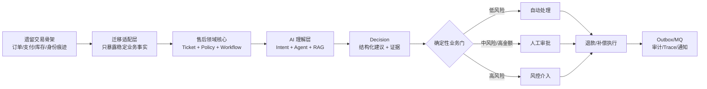

# 电商售后智能运营平台：一周重构开工计划

> 本文件是详细总览，不是首要入口；第一次阅读请从 [README.md](./README.md) 开始。

> 文档状态：`planned`（开工方案，不能替代测试结果）  
> 目标周期：连续 7 天，边写边跑边记录  
> 实施基线：一套遗留电商交易骨架（仓库目录仍保留历史模块名）

## 一句话定位

以遗留交易骨架中的订单、支付、库存和身份能力为迁移起点，重新建模并重构为一套电商售后异常处置平台：用户诉求进入工单，AI 负责理解和收集证据，确定性规则决定自动处理、人工审批或风控介入，工作流负责执行和恢复。原系统只留下少量可复用的基础设施痕迹，不作为最终产品定位。

## 先看一周后的简历结果

一周结束时，简历先写成下面这样；每条后面的 `EV-*` 必须真实存在后才能使用：

```text
电商售后智能运营平台                              个人项目
将遗留交易系统重构为面向订单异常的售后工单平台，覆盖 AI 分析、规则决策、人工审批、退款执行、审计与故障恢复。
• 分层设计售后业务服务与 AI 能力中台，使检索、Agent 编排和模型适配可独立治理；用本地双实例演练验证调用边界和故障隔离（EV-011）。
• 构建可切换的关键词/语义混合检索，加入规则分块、重排、版本绑定和权限过滤；以固定评测集记录召回与引用结果（EV-012）。
• 设计主控 Agent 与白名单工具编排，模型只输出结构化建议，写操作必须经过 Policy + Workflow，并记录失败重试和人工接管（EV-013）。
• 用 Outbox、幂等消费、流程 checkpoint、Trace 和故障注入处理 AI 异步链路的消息重复、通知失败与中断恢复（EV-014）。
```

这是一份“完成并验证后”的目标简历，不是当前事实。没有对应测试、日志或截图时，只能写“设计了”或放进待办，不能写“实现并保证”。完整成稿和背诵话术见 [11-resume-first.md](./11-resume-first.md)。

## 全局总览：先看懂再开工



读图时抓住一个边界：**AI 只把自然语言变成“建议”，售后领域才把建议变成“业务动作”。** 例如模型可以建议退款 399 元，但金额、权限、规则版本、幂等和最终状态必须由 `Policy + Workflow + RefundService` 校验和执行。

| 你要理解的词 | 在本项目中的通俗解释 | 先看哪里 |
|---|---|---|
| LLM | 根据上下文生成文本或结构化 JSON 的推理器 | [phases/phase-4-ai-or-intelligence.md](./phases/phase-4-ai-or-intelligence.md) |
| Intent | 把“我没收到货”归类为物流异常/退款诉求 | AI 阶段“输入”图 |
| Tool/MCP | 给模型使用的受控查询能力，不是数据库通行证 | AI 阶段“工具边界”图 |
| RAG | 先检索公司规则，再让模型依据条款回答 | [09-post-week-evolution.md](./09-post-week-evolution.md) |
| Agent | 按步骤选择多个工具并汇总证据的编排器 | AI 阶段“Agent 回路”图 |
| Workflow | 持久化的业务步骤、审批和可恢复执行 | [04-target-architecture.md](./04-target-architecture.md) |

## 先读什么

1. [01-baseline.md](./01-baseline.md)：当前代码事实与证据。
2. [02-business-goal.md](./02-business-goal.md)：一周只做哪条业务闭环。
3. [03-gap-analysis.md](./03-gap-analysis.md)：为什么做这些切片。
4. [04-target-architecture.md](./04-target-architecture.md)：边界、数据流和失败路径。
5. [10-ai-learning-guide.md](./10-ai-learning-guide.md)：没有 AI 基础时先学什么、每个概念解决什么问题。
6. [phases/](./phases/)：按天执行和验收。
7. [evidence/evidence-index.md](./evidence/evidence-index.md)：每个亮点如何留证。
8. [09-post-week-evolution.md](./09-post-week-evolution.md)：一周之后逐步升级为更完整的企业级项目。

## 可以直接交给 AI 的开发文件

按这个顺序使用，避免让 AI 自己猜接口和字段：

1. [api-contract.md](./api-contract.md)：先生成 DTO、Controller 测试和错误处理。
2. [`sql/updates/006_after_sale_ai.sql`](../../../sql/updates/006_after_sale_ai.sql)：执行建表和规则种子。
3. [schemas/](./schemas/)：把 Decision、工具请求和工具结果校验接进 Service。
4. [scripts/verify-week-one.sh](./scripts/verify-week-one.sh)：服务启动后跑自动验收；响应文件作为 `EV-*` 原材料。

## 一周做出什么

第 7 天必须能在本地演示两条路径，并能用测试或命令复现：

| 路径 | 结果 |
|---|---|
| 低金额、低风险、物流异常 | 自动创建售后单并完成模拟退款 |
| 高金额或高风险 | 创建审批任务；批准后恢复工作流，驳回则终止 |

两条路径都必须显示订单/物流/规则证据、策略判定、流程节点、审计记录和 `trace_id`。真实支付、真实物流、真实大模型不是一周验收条件，分别标记为 `simulation` 或 `planned`。

## 七天高强度时间表

| 天 | 上午 | 下午/晚上 | 当日硬门 |
|---|---|---|---|
| Day 1 | 基线命令、调用链、表盘点 | 售后实体、状态机、规则版本、SQL 草案 | 能画出状态迁移；基线证据已落盘 |
| Day 2 | 建表、实体、Mapper、用户售后 API | 状态机与 Policy 手写；自动路径 | 状态/Policy 单测通过 |
| Day 3 | 审批任务、退款记录、审计 | 工作流 checkpoint；人工审批路径 | 自动/审批/驳回三路可由 curl 验证 |
| Day 4 | Outbox、消费幂等、恢复扫描 | 超时/重试/权限/trace 故障测试 | 重复退款和中断恢复有证据 |
| Day 5 | Decision Schema、Mock LLM、工具白名单 | RAG 分块召回、证据落库 | 非法 Decision 不可执行 |
| Day 6 | 前端工单/详情/审批页 | 端到端演示、审计查询、截图 | 两条主路径完整可演示 |
| Day 7 | 全量测试、演练、回滚检查 | README、简历、面试问答、复盘 | 只交付有证据的结论 |

每天的节奏固定为：15 分钟读设计 -> 90 分钟 AI 生成骨架 -> 90 分钟人工审查核心逻辑 -> 60 分钟测试/故障注入 -> 30 分钟更新证据。任何硬门未通过，第二天先修复，不顺延堆功能。

## 每阶段强制沉淀

每个阶段无论代码量多少，都必须提交以下五类产物，缺一不可：

| 产物 | 必须回答的问题 | 建议位置 |
|---|---|---|
| `THOUGHT.md` | 我观察到什么、难点是什么、哪些逻辑必须手写、AI 输出哪里被修正 | 对应阶段目录 |
| `PIKE.md` | Problem / Insight / Key Decisions / Evidence 如何闭环 | 对应阶段目录 |
| `CHANGELOG.md` | 改了哪些文件、接口、表和配置，是否有回滚点 | 对应阶段目录 |
| 验证记录 | 命令、输入、预期、实际、环境、限制是什么 | `evidence/EV-*.md` |
| 面试卡片 | 一句话亮点、三层追问、失败场景、取舍和未完成项 | 对应阶段目录或 `08-interview-story.md` |

AI 可以代写初稿，但开发者必须亲自补齐“为什么这样设计、为什么不用替代方案、失败时怎么办”。没有思考记录和面试卡片的代码，即使功能通过也不算阶段完成。

## 事实、假设和范围

| 类型 | 当前声明 |
|---|---|
| `observed` | 现有模块、依赖、端口、表、消息和测试，见 [01-baseline.md](./01-baseline.md) |
| `planned` | `bookmall-after-sale`、AI 编排、MCP 工具契约、售后规则 RAG、审批工作流 |
| `simulation` | Mock 物流、Mock LLM、模拟退款，不接真实资金渠道 |
| 待确认 | 本周是否新增物理微服务；默认先在售后服务内模块化，避免拆分拖慢闭环 |

## 明确不做

第一周先不做多租户、完整权限后台、真实物流/支付、向量数据库、Kubernetes、多 Agent 和跨地域容灾。它们只是后续可选任务，见 [09-post-week-evolution.md](./09-post-week-evolution.md)；当天完不成主链路就不切换赛道。

## AI 编码协作规则

- AI 负责骨架、Mapper、DTO、页面、测试样板和文档初稿。
- 人工必须审查并理解状态机、策略引擎、Decision 校验、幂等、Outbox、权限和恢复逻辑。
- 每次 AI 修改都先跑模块测试，再更新证据；没有验证的数字只能写目标。
- 不让模型直接生成并执行退款、改订单状态或改库存的自由工具。

## 变更日志

| 日期 | 变更 |
|---|---|
| 2026-08-30 | 建立企业增强文档仓库；基于现有代码和已有阶段文档冻结一周范围 |
