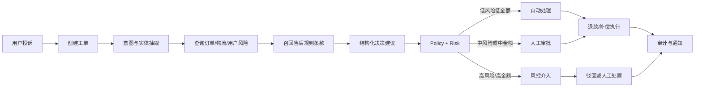
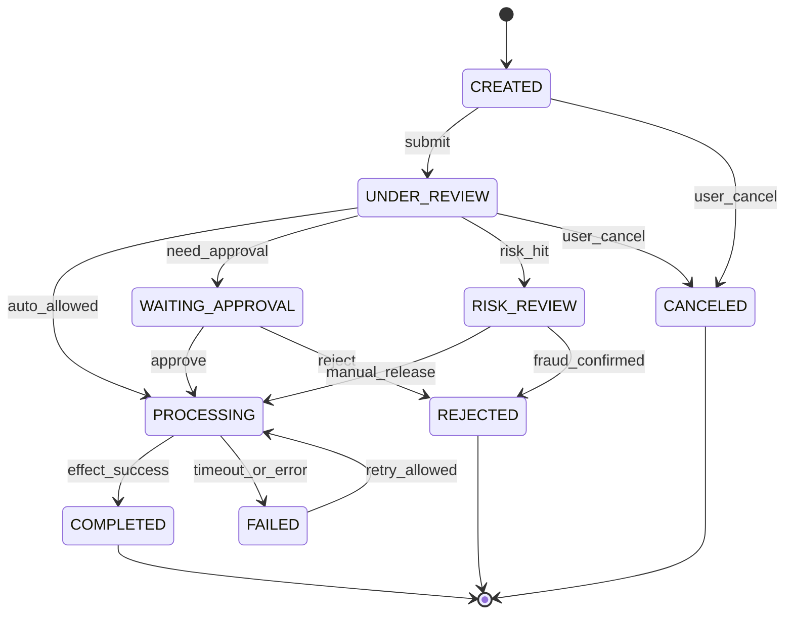

# 业务目标与边界

## 场景

重构后的平台面向综合电商订单异常售后处置。遗留交易骨架提供订单、支付、库存和用户身份的迁移样本；最终业务不再围绕图书，而是围绕物流未收到、商品破损、少件、退款和补偿等售后事件组织用户与运营人员工作。

## 角色与权限

| 角色 | 可做什么 | 不可做什么 |
|---|---|---|
| 买家 | 创建/查看自己的售后单，补充消息和证据 | 查看他人订单、审批、修改策略 |
| 客服 | 查看工单队列、补充分析、转人工 | 直接绕过策略执行资金动作 |
| 审批人 | 查看分配给自己的高风险任务，批准/驳回 | 修改原始订单金额、冒充用户 |
| 风控人员 | 查看风险证据、标记欺诈、终止流程 | 直接伪造支付成功 |
| 系统 Worker | 推进超时重试和 Outbox | 以客户端身份访问受限接口 |

权限边界以网关 JWT 的可信 `X-User-Id` 为起点，售后服务再次做资源归属和角色校验；不信任客户端自行传入的用户 ID。

## 核心对象

`AfterSaleOrder` 表达退款/补偿结果，`Ticket` 表达沟通和处理过程，`WorkflowInstance/Step` 表达可恢复执行，`ApprovalTask` 表达人工决策，`PolicyVersion/Rule` 表达生效规则，`RiskRecord` 表达风险判断，`AuditLog` 表达不可抵赖的关键动作，`OutboxEvent` 表达最终一致性。

## 主流程

## 状态约束

售后状态建议：`CREATED -> UNDER_REVIEW -> PROCESSING -> COMPLETED`；需要审批时经过 `WAITING_APPROVAL`，拒绝进入 `REJECTED`，用户取消进入 `CANCELED`，工具或外部依赖失败进入可重试的 `FAILED`。任何迁移都由一张显式迁移表校验，禁止用多个布尔字段拼状态，也禁止 `CREATED -> COMPLETED` 直跳。

状态图不是装饰：每条箭头都对应一个事件、权限和可测试的前置条件。实现时先把图翻译成迁移表，再写代码；不要先写 Controller 再靠 if/else 猜状态。

## 一周验收场景

| 用例 | 种子条件 | 预期 |
|---|---|---|
| A 自动退款 | 订单金额 39.80、物流异常、低风险、规则版本 v1 | AI 给出建议；Policy 允许；退款记录唯一；工单完成 |
| B 人工审批 | 订单金额 399、物流异常或高风险、规则要求审批 | 创建审批任务；批准后继续退款，驳回后 `REJECTED` |
| C 重复请求 | 相同用户、订单、动作和金额重复提交 | 返回已有售后/退款结果，不产生第二条执行记录 |
| D 流程恢复 | 在执行步骤后强制停止 Worker | 重启扫描未完成 step，按重试上限恢复或转人工 |

## 规模假设与 SLO 目标

这是本地单机验证，不是生产容量承诺。第一周采用：100 个种子订单、并发 5、单工单同步响应目标 P95 <= 2s（AI Mock 模式）、异步步骤最终完成 <= 30s、重复退款执行次数 = 1。真实模型和更大规模属于后续压测目标。

## 不做项

不接真实物流和资金渠道，不做复杂退货入库，不做多租户计费，不让 LLM 直接执行写操作，不以“接入 MCP/RAG”替代业务闭环，不把模拟指标写成生产结果。
