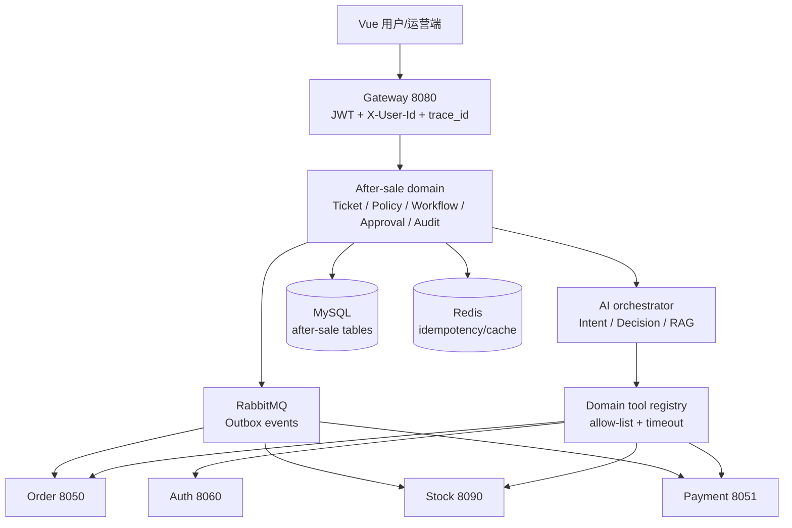
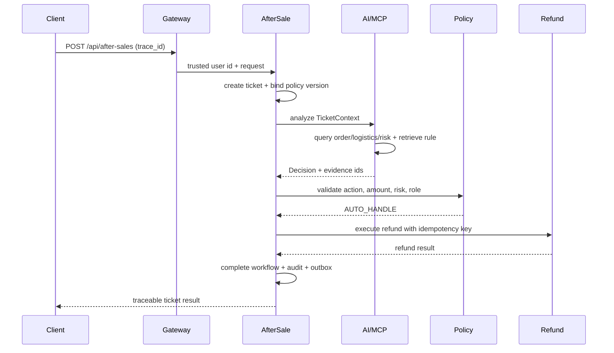
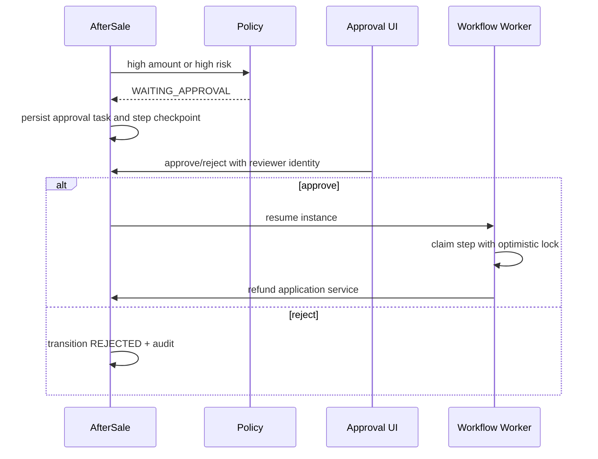

# 目标架构、数据流与故障路径

## 系统边界

第一周新增逻辑上独立的售后域、AI 编排域和领域工具层；物理上优先新增一个 `bookmall-after-sale`，AI/MCP 作为包或同服务模块，待闭环稳定后再拆服务。

**关键假设**：AI 和 MCP 不能直接拿数据库连接；所有写动作由售后域的策略和工作流调用受控 application service。Gateway 生成或透传 `trace_id`，下游不得接受客户端伪造的 `X-User-Id`。

## 请求时序：低风险自动处理

## 请求时序：人工审批与恢复

## 数据与事件

核心表建议：`t_after_sale_order`、`t_after_sale_ticket`、`t_ticket_message`、`t_workflow_instance`、`t_workflow_step`、`t_approval_task`、`t_refund_record`、`t_risk_record`、`t_policy_version`、`t_policy_rule`、`t_audit_log`、`t_rag_document`、`t_rag_chunk`、`t_after_sale_outbox`。每个表都要有创建/更新时间、业务主键和必要索引；金额使用 `DECIMAL`。

事件示例：`AFTER_SALE_CREATED`、`REFUND_EXECUTED`、`AFTER_SALE_COMPLETED`。Outbox 与业务记录同一数据库事务写入；发送失败由 Worker 重试，消费者以 `event_id` 和业务状态幂等。

## 故障路径

| 故障 | 处理 | 用户/运营可见结果 |
|---|---|---|
| 订单/物流工具超时 | 单工具超时、有限重试；Decision 降级为 `NEEDS_HUMAN` | 工单待人工，不自动退款 |
| LLM 非法 JSON/action | Schema 校验失败，记录原文，转人工 | 不进入业务执行 |
| 退款调用超时 | 退款记录 `PENDING`，按幂等键查询/重试 | 不创建第二条退款 |
| 退款成功但事件发送失败 | Outbox 保留 `CREATED/FAILED`，Worker 重发 | 工单可见“处理中” |
| Worker 宕机 | Step 保留 checkpoint，恢复扫描处理 | 可恢复或超过上限转人工 |
| 审批并发 | 乐观锁/状态条件更新 | 只有一个终态生效 |
