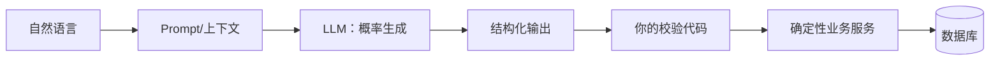
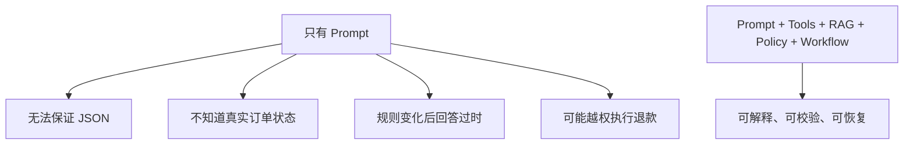

# AI 学习与实现导览

这份导览给没有系统学过 AI、但要在一周内写出可维护代码的开发者。先掌握最小概念，再实现一个可验证的售后决策链路；不要求先学完整数学或训练模型。

## 1. 先建立正确心智模型

LLM 的本质是“根据上下文生成最可能的下一个结果”，不是数据库、规则引擎或事务管理器。因此必须把它放在业务代码的一个可替换接口后面，并对输出做 Schema 校验。模型说得很自信，不代表事实正确。

## 2. 五个概念的学习顺序

| 顺序 | 概念 | 你在项目里要解决的问题 | 最小实践 |
|---:|---|---|---|
| 1 | LLM/Prompt | 把用户话术整理成固定字段 | Mock 输入返回 Intent JSON |
| 2 | Structured Output | 防止模型输出无法解析或越权动作 | 校验 `Decision` 枚举、金额和必填字段 |
| 3 | Tool Calling / MCP | 让模型查询订单、物流等外部事实 | 先做只读工具白名单和超时 |
| 4 | RAG | 让回答依据当前售后规则和版本 | MySQL chunk 召回条款并返回来源 |
| 5 | Agent/Workflow | 串起多步查询、审批和恢复 | Agent 给建议，Workflow 执行状态迁移 |

## 3. 用一个例子贯穿

用户说：“包裹显示签收了，但我没拿到，直接退钱吧。”

1. `IntentExtractor` 提取 `logistics_exception + refund_request`，并识别订单号。
2. Agent 调用 `query_order` 和 `query_logistics`，得到金额、签收时间、签收位置等事实。
3. `RagRetriever` 召回“物流签收未收到”条款，返回 `chunk_id` 和 `policy_version`。
4. LLM 输出建议：先联系驿站；若确认丢件，建议退款 399 元，并附证据 ID。
5. `DecisionValidator` 检查 action、金额、证据、版本；失败就转人工。
6. `PolicyService` 根据金额和风险决定自动处理或审批。
7. `WorkflowService` 执行退款或等待审批；退款服务使用幂等键。

## 4. 为什么不能只写一个 Prompt

Prompt 解决“怎么表达”，不能单独解决事实、权限、一致性和恢复。面试时先讲业务约束，再讲模型能力，顺序不要反过来。

## 5. 每个 AI 请求都要留的记录

至少记录：`trace_id`、工单 ID、provider/model、prompt_version、输入摘要、工具调用列表、召回 chunk/版本、Decision JSON、Schema 校验结果、耗时、Token、成本估算和人工修改。敏感信息做脱敏；Mock 结果标记 `simulation`。

## 6. 初学者常见误区

| 误区 | 修正方式 |
|---|---|
| 看到 Agent 就让它直接调 Service | 先画权限边界，只允许只读工具 |
| 模型返回“退款”就立即执行 | 经过 Schema、Policy、Risk、Approval 和 Workflow |
| 上传文档后就叫 RAG | 说明切分、召回、版本、来源和评测集 |
| Mock 固定返回正确就说 AI 准确 | 只说契约测试通过；真实效果等评测证据 |
| 先接向量库再想业务 | 先用 MySQL chunk 跑通可解释闭环 |

## 7. 学习验收

完成本导览后，开发者应能不看代码回答：模型输入是什么、工具为什么只读、RAG 返回什么证据、Decision 如何校验、Policy 与 Workflow 谁负责执行，以及模型/工具失败时用户会看到什么状态。
