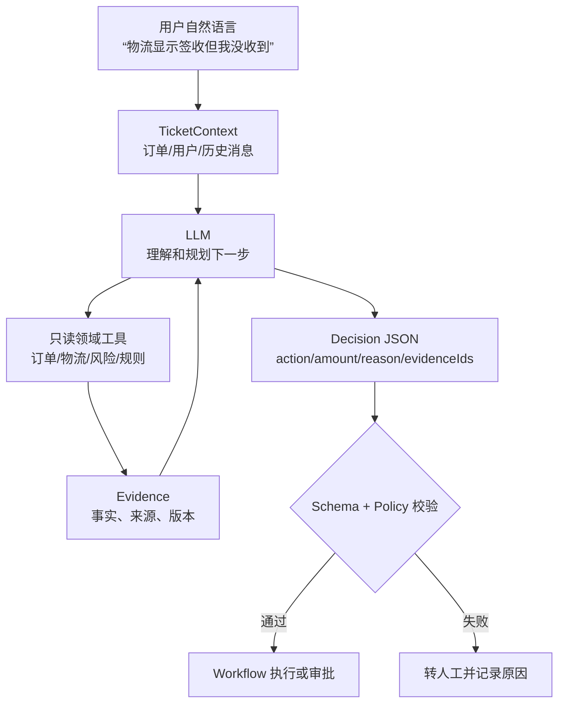
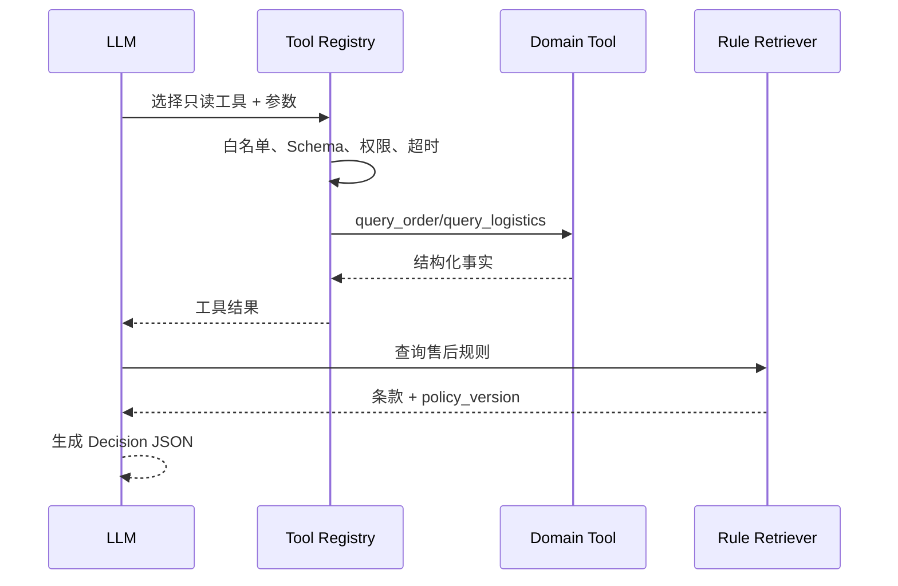

# 阶段 4：接入 AI，但不把权限交给 AI（第 5 天下午至第 6 天上午）

## 目标与业务价值

让 AI 真正减少工单理解和证据收集工作，但不改变资金、权限和状态的最终控制权。

## 先理解：AI 在链路里做什么

如果你第一次接触 LLM、Tool Calling、RAG 或 Agent，先阅读 [AI 学习与实现导览](../10-ai-learning-guide.md)，再回到本阶段写代码。

初学者可以把它理解成四步：**听懂诉求（Intent） -> 查资料（Tools） -> 找依据（RAG） -> 给建议（Decision）**。模型不保存订单真相，也没有退款权限；工具返回的事实和数据库状态才是业务依据。

## 输入、输出和边界

| 环节 | 输入 | 输出 | 不能做什么 |
|---|---|---|---|
| Intent | 用户文本、工单历史 | `logistics_exception`、`refund_request` 等枚举 | 不能修改订单 |
| Tool | 结构化 ID、权限上下文 | 订单/物流/风险事实 | 不能绕过服务权限和审计 |
| RAG | 类目、关键词、规则版本 | 条款 chunk、来源、分数 | 不能把相似文本当最终规则 |
| Decision | 事实 + 条款 + Policy 摘要 | 建议动作、金额、理由、证据 ID | 不能直接调用退款写接口 |
| Workflow | 已校验 Decision、审批结果 | 状态迁移、退款/补偿结果 | 不能接受任意跳转 |

## 前置条件

确定性售后闭环和故障门已通过；准备规则文档、Mock 物流和 Mock LLM fixture。

## 今天照着做

1. 先不接真实模型：创建 `MockLlmClient`，对同一 `TicketContext` 固定返回一个合法 Decision。
2. 定义 `Decision` JSON Schema 和枚举，先写非法 action、负金额、空证据的失败测试。
3. 实现五个只读工具的注册表，调用参数统一带 `trace_id` 和用户身份。
4. 插入 4 条售后规则文档和分块，用“签收但未收到”查询，检查返回条款 ID/版本。
5. 将工具结果、召回条款和 Decision 一起落库；失败时只创建人工任务，不调用退款。

## 修改范围

`LlmClient`、`TicketContext`、`Decision` Schema、Intent、领域工具注册表、RAG 分块/召回、AI 调用审计。

## 本阶段的高分目标

本阶段不是“接一个聊天接口”，而是交付一个可独立调用的 AI 中台最小版本：售后服务只调用 `analyze(ticketContext)`，AI 中台内部负责意图识别、证据检索、工具编排和结构化输出。至少拆出 `IntentAgent`、`EvidenceAgent`、`ComplianceAgent` 三个职责；可以先在同一进程中运行，接口和日志按独立服务设计。

## 实施切片

1. 定义只读工具：`query_order`、`query_logistics`、`query_delivery_proof`、`query_user_risk`、`query_after_sale_rule`。
2. 工具注册包含输入 Schema、权限、超时和审计；不注册退款/改状态工具。
3. MySQL 保存规则文档和 chunk，按类目/标签/关键词召回并返回条款 ID、版本和分数。
4. Mock LLM 按固定 JSON 返回 `action/amount/reason/evidenceIds/policyVersion`；真实 Provider 仅实现同一接口。
5. Decision 校验失败转人工；工具失败保留错误证据，不自动执行。
6. 设计 20 个评测问题，但第一周只要求记录召回结果，不宣称模型准确率。

### 混合检索的本周做法

先定义 `Retriever` 接口和统一返回结构，再按环境选择实现：

1. 有时间准备基础设施时，接 Elasticsearch 关键词检索 + Milvus 向量检索，保存两路分数和最终重排结果。
2. 基础设施不稳定时，使用 MySQL 关键词检索 + 本地语义替身完成同一契约和评测；简历只能写“可切换混合检索设计/本地模拟”，不能写已经落地 ES/Milvus 集群。
3. 无论哪种实现，都必须做规则版本绑定、权限过滤、上下文长度上限和召回失败转人工。

## Agent 的最小回路

不要把 Agent 想成“会自己做所有事的人”。在本项目里，它更像一个有边界的调度器：每次调用都要说明工具、参数、返回事实和下一步理由；循环次数、超时和失败都有限制。

## 交付产物

AI/MCP 契约、Mock provider、RAG 种子数据、Decision 单测、工具审计样例。

## 验证方案

同一 fixture 稳定输出；非法 action/金额被拒绝；物流口语问题命中对应规则版本；工具超时不产生退款。

## 风险与回滚

默认 `mock`；关闭 AI 分析时工单进入人工队列，确定性 Policy 仍可执行。

## 停止条件

AI 结果无法被 Schema 校验或证据缺失时，停在人工处置，不接真实 Provider。

## 面试证据

工具白名单、Decision JSON、规则条款证据和失败转人工日志。

## 必须沉淀

- `THOUGHT.md`：解释 AI 负责理解/判断而非执行，记录一次被人工否决或修正的模型输出。
- `PIKE.md`：记录 MCP vs 普通 HTTP、关键词 RAG vs 向量 RAG 的取舍和边界。
- `CHANGELOG.md`：记录 Schema、prompt/provider、工具白名单和规则种子变化。
- 面试卡片：非法 JSON、幻觉动作、召回错误、工具超时各准备三层追问答案。

## 状态

`planned`
